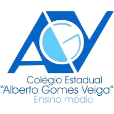

# 📚 README - AGV ENEM 2026

## 🎓 Plataforma de Estudos para o ENEM do Colégio Estadual Alberto Gomes Veiga - Paranaguá



---

## 📋 **SOBRE O PROJETO**

O **AGV ENEM** é uma plataforma web desenvolvida para auxiliar os alunos do Colégio Estadual Alberto Gomes Veiga (Paranaguá/PR) na preparação para o Exame Nacional do Ensino Médio (ENEM). O projeto oferece um ambiente virtual completo com simulados, mapas mentais, correção de redação e materiais de estudo.

### 🎯 **Objetivos**

- ✅ Oferecer simulados digitais com sistema anti-cola
- ✅ Disponibilizar mapas mentais de todas as matérias do ENEM
- ✅ Sistema de correção de redação com as 5 competências
- ✅ Provas anteriores para download (ENEM 2020-2025)
- ✅ Informações sobre vestibulares locais (UNESPAR, IFPR, PORTOS)
- ✅ Ambiente personalizado por série (1º, 2º e 3º ano)

---

## 🚀 **TECNOLOGIAS UTILIZADAS**

| Tecnologia | Versão | Uso |
|------------|--------|-----|
| HTML5 | - | Estrutura das páginas |
| CSS3 | - | Estilização e animações |
| JavaScript | ES6+ | Funcionalidades interativas |
| LocalStorage | - | Armazenamento de dados do usuário |
| Flexbox/Grid | - | Layout responsivo |
| Font Awesome | - | Ícones (quando aplicável) |

---

## 📁 **ESTRUTURA DO PROJETO**

```
agv-enem/
├── 📄 Ambiente Virtual.html          # Página principal
├── 📄 login.html                     # Login e cadastro
├── 📄 favicon.ico                    # Ícone do site
├── 📄 favicon-16x16.png               # Favicon 16x16
├── 📄 favicon-32x32.png               # Favicon 32x32
├── 📄 apple-touch-icon.png            # Ícone para iOS
├── 📄 android-chrome-192x192.png      # Ícone para Android
├── 📄 android-chrome-512x512.png      # Ícone para Android (alto res)
├── 📄 site.webmanifest                 # Configuração PWA
├── 📄 browserconfig.xml                # Configuração Windows
├── 🖼️ Logo_agv-removebg-preview.png    # Logo principal
├── 📁 provas/                          # PDFs das provas ENEM
├── 📁 gabaritos/                       # PDFs dos gabaritos
├── 📁 redacao/                         # Páginas de redação
│   ├── treino.html
│   ├── temas-2026.html
│   └── dicas-redacao.html
├── 📁 mapas/                            # Mapas mentais
│   ├── redacao-mapa.html
│   ├── matematica-mapa.html
│   ├── quimica-mapa.html
│   ├── fisica-mapa.html
│   ├── biologia-mapa.html
│   ├── historia-mapa.html
│   ├── geografia-mapa.html
│   ├── filosofia-mapa.html
│   ├── sociologia-mapa.html
│   └── ingles-mapa.html
└── 📁 simulados/                         # Simulados ENEM
    ├── simulado-2025.html
    ├── simulado-2024.html
    ├── simulado-2023.html
    ├── simulado-2022.html
    ├── simulado-2021.html
    └── simulado-2020.html
```

---

## ✨ **FUNCIONALIDADES PRINCIPAIS**

### 🔐 **Sistema de Login/Cadastro**
- Cadastro com e-mail institucional (@escola.pr.gov.br)
- Validação de senha forte (6+ caracteres, número, caractere especial)
- Seleção de turma por série e curso técnico
- Persistência de login com localStorage

### 📝 **Simulados ENEM (2020-2025)**
- ✅ 180 questões por simulado (45 por matéria)
- ✅ Sistema anti-cola (bloqueia troca de aba)
- ✅ Timer de 5h30 (igual ao ENEM)
- ✅ Alertas de tempo (30min, 10min, 5min)
- ✅ Navegador rápido de questões
- ✅ Cálculo automático de nota (0-1000)
- ✅ Liberação de gabaritos após conclusão

### 🧠 **Mapas Mentais (10 disciplinas)**
- Redação
- Matemática
- Química
- Física
- Biologia
- História
- Geografia
- Filosofia
- Sociologia
- Inglês

### ✍️ **Sistema de Redação**
- Propostas de redação
- Temas para 2026
- Dicas baseadas nas 5 competências
- Correção simulada

### 📚 **Vestibulares Locais**
- UNESPAR - Campus Paranaguá
- IFPR - Campus Paranaguá
- PORTOS DO PARANÁ
- Dicas de estudo por curso

---

## 🎨 **DESIGN E ANIMAÇÕES**

### 🎯 **Cores Institucionais**
| Cor | Uso | Hex |
|-----|-----|-----|
| Azul Marinho | Fundo, títulos | `#0a1929` |
| Azul Escuro | Elementos secundários | `#1a3a5f` |
| Azul Médio | Botões, destaques | `#2b5a8c` |
| Azul Claro | Cards, fundos | `#ebf5ff` |
| Dourado | Detalhes, ícones | `#ffd700` |

### ✨ **Animações**
- ✅ Efeito de onda nos botões
- ✅ Loading screens com spinner
- ✅ Transições suaves entre páginas
- ✅ Partículas flutuantes no login
- ✅ Hover effects em cards e botões
- ✅ Scroll suave na navegação

---

## 🚀 **COMO EXECUTAR O PROJETO**

### 📋 **Pré-requisitos**
- Navegador moderno (Chrome, Firefox, Edge, Safari)
- Servidor local (opcional - pode abrir diretamente)

### 🔧 **Passos para execução**

1. **Clone o repositório**
```bash
git clone https://github.com/seu-usuario/agv-enem.git
cd agv-enem
```

2. **Estrutura de pastas**
```bash
# Crie as pastas necessárias
mkdir provas gabaritos redacao mapas simulados
```

3. **Adicione os PDFs das provas**
- Coloque os arquivos PDF do ENEM nas pastas `provas/` e `gabaritos/`

4. **Abra no navegador**
- Dê duplo clique em `Ambiente Virtual.html`
- Ou use um servidor local (Live Server do VS Code)

---

## 📱 **RESPONSIVIDADE**

O projeto é totalmente responsivo e se adapta a:

| Dispositivo | Largura | Comportamento |
|-------------|---------|---------------|
| Desktop | > 1024px | Layout completo |
| Tablet | 768px - 1024px | Grid ajustado |
| Celular | < 768px | Menu colapsável, cards em 1 coluna |

---

## 🔒 **SISTEMA ANTI-COLA**

Os simulados contam com proteção avançada:

```javascript
// Bloqueia troca de aba
document.addEventListener('visibilitychange', function() {
    if (document.hidden) {
        alert('⚠️ Tentativa de cola registrada!');
    }
});

// Bloqueia sair da página
window.addEventListener('blur', function() {
    // Ativa bloqueio
});
```

---

## 📊 **ESTATÍSTICAS DO PROJETO**

| Item | Quantidade |
|------|------------|
| Páginas HTML | 22 |
| Simulados | 6 (1080 questões) |
| Mapas mentais | 10 |
| Arquivos de imagem | 10 |
| Linhas de código | ~15.000 |

---

## 👨‍💻 **DESENVOLVEDORES**

| Função | Nome |
|--------|------|
| **Desenvolvedor Principal** | Davi Souza do Carmo + IA |
| **Administrativo** | Julia Silveira |

---

## 🙏 **AGRADECIMENTOS ESPECIAIS**

### 👨‍🏫 **Aos Professores:**
- **Lucas** - Pelo suporte e orientação técnica
- **Gabriel** - Pelas contribuições e revisões

### 📚 **A todos os professores das matérias convencionais:**
- Matemática
- Português/Literatura
- Filosofia
- Sociologia
- História
- Geografia
- Física
- Química
- Biologia
- Inglês/Espanhol
- Artes

---

## 📌 **FONTES DAS INFORMAÇÕES**

As informações e questões presentes neste projeto foram baseadas em:

| Fonte | Descrição |
|-------|-----------|
| **INEP - ENEM** | Provas e gabaritos oficiais do ENEM (2020-2025) |
| **UNESPAR** | Informações sobre vestibulares |
| **IFPR** | Processos seletivos e editais |
| **Portos do Paraná** | Programas de estágio |
| **Brasil Escola** | Conteúdos de apoio |
| **Khan Academy** | Exercícios complementares |
| **Curso Enem Gratuito** | Materiais de estudo |

---

## 📄 **LICENÇA**

Este projeto é de uso exclusivo do **Colégio Estadual Alberto Gomes Veiga** para fins educacionais.

© 2026 Colégio Estadual Alberto Gomes Veiga - Todos os direitos reservados.

---

## 📌 **LINKS ÚTEIS**

- [INEP - ENEM](https://www.gov.br/inep/pt-br)
- [UNESPAR](https://www.unespar.edu.br/)
- [IFPR - Paranaguá](https://ifpr.edu.br/paranagua/)
- [Portos do Paraná](https://www.portosdoparana.pr.gov.br/)
- [Brasil Escola](https://brasilescola.uol.com.br/)
- [Khan Academy](https://www.khanacademy.org/)
- [Curso Enem Gratuito](https://cursoenemgratuito.com.br/)

---

## 🎯 **PRÓXIMAS ATUALIZAÇÕES**

- [ ] Implementar ranking de pontuação
- [ ] Adicionar correção automática de redação
- [ ] Incluir videoaulas
- [ ] Versão PWA para instalação
- [ ] Modo escuro
- [ ] Estatísticas de desempenho por matéria

---

## 💻 **EXEMPLO DE CÓDIGO - SIMULADO**

```javascript
// Sistema de timer do simulado
function iniciarTimer() {
    timerInterval = setInterval(() => {
        tempoRestante--;
        
        if (tempoRestante <= 0) {
            finalizarSimulado();
        }
        
        atualizarTimer();
        
        // Alertas de tempo
        if (tempoRestante === 1800) alert('30 minutos restantes!');
        if (tempoRestante === 600) alert('10 minutos restantes!');
        if (tempoRestante === 300) alert('5 minutos restantes!');
    }, 1000);
}
```

---

## 📞 **CONTATO**

Para dúvidas, sugestões ou reportar problemas:
- 📧 enem@agv.pr.gov.br
- 📍 R. Julia da Costa, 123 - Centro - Paranaguá/PR

---

**🚀 Preparação completa para o ENEM!**


---

> *"A educação é a arma mais poderosa que você pode usar para mudar o mundo."* - Nelson Mandela

---

## 📝 **VERSÃO**

**Versão Atual:** 1.0.0  
**Última Atualização:** Março/2026  
**Status do Projeto:** Em desenvolvimento ativo 🚧
